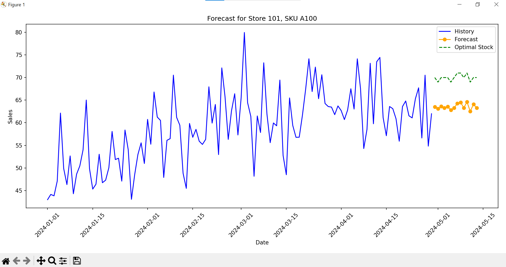
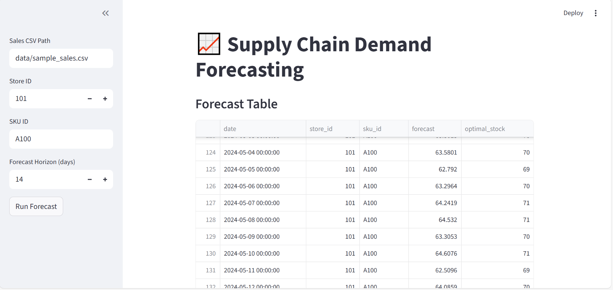
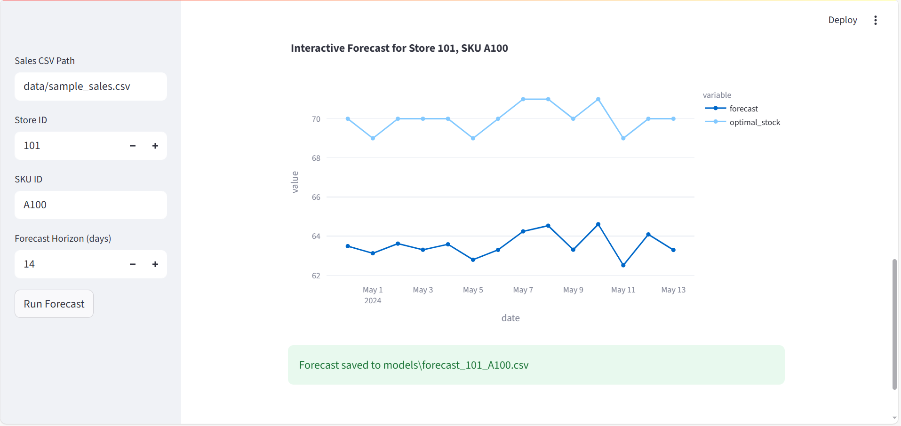

# Supply Chain Demand Forecasting (End-to-End)

A project that forecasts SKU demand per store, exposes a **Flask API** for real-time predictions, and provides a **Streamlit dashboard** for visualization.

---

## What it includes

* `src/train.py` — trains a model (scikit-learn GradientBoostingRegressor) with feature engineering (lags, rolling means, calendar features).
* `src/predict.py` — batch inference script.
* `api/app.py` — Flask API for real-time predictions.
* `dashboard.py` — Streamlit app for interactive demand visualization.
* `utils/feature_engineering.py` — reusable feature functions.
* `data/sample_sales.csv` — synthetic dataset to run out-of-the-box.
* `models/` — saved model artifacts (`model.joblib`, `features.json` created after training).

---

## Quickstart

```bash
# 1) Create & activate a venv (recommended)
python -m venv .venv
# Windows: .venv\Scripts\activate
# Linux/Mac:
source .venv/bin/activate

# 2) Install deps
pip install -r requirements.txt

# 3) Train on the sample dataset (or replace with your own CSV)
python src/train.py --data_path data/sample_sales.csv --horizon 14

# 4) Run API
python api/app.py
# POST prediction:
# curl -X POST http://127.0.0.1:5000/predict -H "Content-Type: application/json" -d @api/sample_request.json

# 5) Batch predict on future dates
python src/predict.py --future_days 14 --store_id 101 --sku_id A100

# 6) Launch Streamlit Dashboard
streamlit run dashboard.py
```

---

## Dataset format (CSV)

Required columns:

* `date` (YYYY-MM-DD)
* `store_id` (int)
* `sku_id` (string)
* `on_promo` (0/1)
* `price` (float)
* `sales` (float) — target

You can add more features (weather, stock levels, lead time, holidays) and join by `date, store_id, sku_id`.

---

## Visualization

The **Streamlit dashboard** provides interactive visualizations of forecasts vs. actual sales using **Matplotlib**.

Example code snippet:

```python
import matplotlib.pyplot as plt

fig, ax = plt.subplots()
ax.plot(history["date"], history["sales"], label="Actual")
ax.plot(forecast["date"], forecast["prediction"], label="Forecast", linestyle="--")
ax.set_xlabel("Date")
ax.set_ylabel("Sales")
ax.legend()
st.pyplot(fig)
```

---

## 📸 Screenshots

### 1. Sales Forecast Visualization
Historical sales, predicted demand, and optimal stock levels for **Store 101, SKU A100**.  


### 2. Streamlit Dashboard - Home
Interactive dashboard view built with Streamlit.  


### 3. Streamlit Dashboard - Dropdown Filters
Selecting Store & SKU dynamically to update forecasts.  



---

## Example Output:
        date  store_id sku_id   forecast  optimal_stock
2024-04-30       101   A100  63.486326           70.0
2024-05-01       101   A100  63.122531           69.0
2024-05-02       101   A100  63.615396           70.0
2024-05-03       101   A100  63.301324           70.0
2024-05-04       101   A100  63.580126           70.0
2024-05-05       101   A100  62.791952           69.0
2024-05-06       101   A100  63.296388           70.0
2024-05-07       101   A100  64.241920           71.0
2024-05-08       101   A100  64.532003           71.0
2024-05-09       101   A100  63.305344           70.0
2024-05-10       101   A100  64.607649           71.0
2024-05-11       101   A100  62.509647           69.0
2024-05-12       101   A100  64.085888           70.0
2024-05-13       101   A100  63.291340           70.0

---

## Requirements

Main dependencies:

* pandas
* scikit-learn
* Flask
* joblib
* matplotlib
* streamlit

---

## Notes

* The example uses **scikit-learn** for reliability in small projects. Swap the model for XGBoost/LightGBM easily.
* The feature pipeline builds lag features (1,7,14), rolling means (7,14), and calendar features without leakage.
* The API performs feature generation using the most recent history + future calendar features to return a horizon forecast.

---

## Future Work

* Add holiday features (Prophet-style regressors).
* Support multiple models (XGBoost, LightGBM, LSTM).
* Dockerize API & dashboard for deployment.
* Integrate real-world external data (weather, inventory).

---

